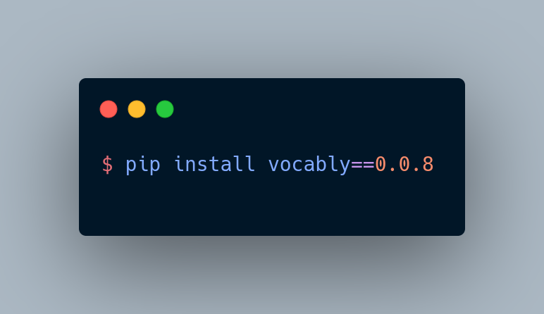

<div>
<a href="https://colab.research.google.com/drive/1q56gWXSik2XCT2pqjSD8kv3fLvfvoI1n?usp=sharing"></a>
 <a href = 'https://pypi.org/project/vocably/'> </a>
</div>

# Vocably

</img>

Vocably is a Natural Language Processing (NLP) Framework written with the purpose to increase the flow of our development in daily basis.
## Quick Installation

```bash
$ pip install vocably
```
## Installation from source 
```bash
$ git clone https://github.com/Nandhini25S/Vocably.git
$ cd Vocably
$ conda env create -f environment.yml
$ export PYTHONPATH=./src
$ python3 setup.py install
```

## Using Makefile (for Linux or Mac Users)
```bash
$ git clone https://github.com/Nandhini25S/Vocably.git
$ cd Vocably
$ conda env create -f environment.yml
```
now we will activate this environment
```bash
$ conda activate vocably
```
to install and config

```bash
$ export PYTHONPATH=./src
$ make install
$ make configure
```
or 
```bash
$ make all
```
## Using batch file (for Windows users)

```bash
$ git clone https://github.com/Nandhini25S/Vocably.git
$ cd Vocably
$ conda env create -f environment.yml
```
now we will activate this environment
```bash
$ conda activate vocably
```
to install and config

```bash
$ Scripts/install.bat
$ Scripts/config.bat
```
